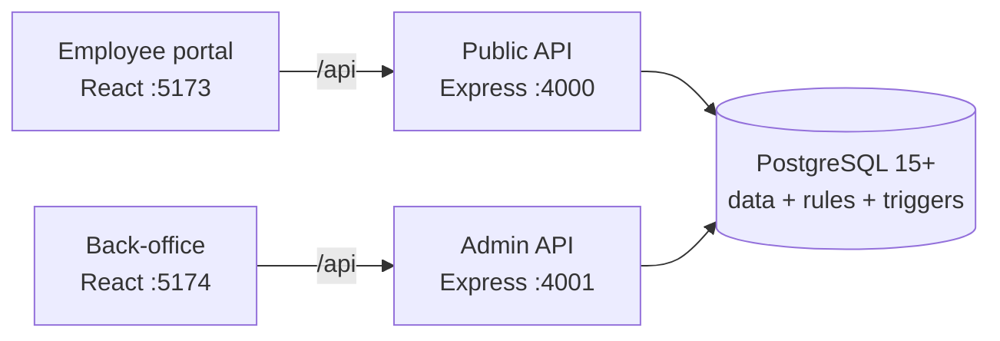

# Open Teams


**The whole office in one portal** — people, departments, projects, tasks, HR requests, and team chat — with one simple rule enforced everywhere: *work only ever flows downhill.*

---

- [What is this?](#what-is-this)
- [Take the 5-minute tour](#take-the-5-minute-tour)
- [Meet the demo company](#meet-the-demo-company)
- [The one rule that runs everything](#the-one-rule-that-runs-everything)
- [Tour of the screens](#tour-of-the-screens)
- [How it's built](#how-its-built)
- [Run it yourself](#run-it-yourself)
- [Deploy it anywhere](#deploy-it-anywhere)
- [API at a glance](#api-at-a-glance)
- [Contribute](#contribute)
- [License](#license)

---

## What is this?

Imagine your company as a building. Open Teams is the directory in the lobby, the project rooms upstairs, the HR desk on the third floor, and the hallways where people actually talk — all in one web app.

Concretely, it gives every employee a portal (branded **Office HQ**) where they can see their own work, run projects with tasks and deadlines, staff teams without overloading people, file HR requests, and chat — one-on-one or in groups. Admins get a separate, locked-down back-office for managing people, logins, and security.

Underneath, it's deliberately boring technology: **PostgreSQL** for data, **Node + Express** for the API, **React** for the UI. No exotic frameworks, no cloud lock-in — you can run the entire thing on a laptop or a ten-dollar server.

## Take the 5-minute tour

You need Node 20+ and PostgreSQL 15+. That's it.

```bash
git clone https://github.com/Manikanta070610/open-teams.git
cd open-teams
./setup.sh            # interactive: asks questions, does everything
```

The setup script installs dependencies, builds the database (with a demo company inside), verifies it, and builds the app. Then:

```bash
npm run dev --prefix backend     # API on :4000
npm run dev --prefix frontend    # portal on :5173
```

Open http://localhost:5173. You'll land on the login page — which brings us to the demo company, because someone has to let you in.

> **Prefer Docker?** `./setup.sh --docker` boots Postgres, both APIs, and both portals in one stack. Details in [Deploy it anywhere](#deploy-it-anywhere).

## Meet the demo company

Setup seeds a small fictional company so you can feel how the app behaves at different levels of power:

| Who | Email | Rank | Reports to |
| --- | ----- | ---- | ---------- |
| Ava Owner, CEO | `ceo@example.com` | 6 — Owner | — |
| Ben CTO | `cto@example.com` | 5 — C-Suite | Ava |
| Cara Manager | `manager@example.com` | 4 — Manager | Ben |
| Dev Senior | `l3@example.com` | 3 — Senior | Cara |
| Eli Associate | `l2@example.com` | 2 — Associate | Dev |
| Fay Junior | `l1@example.com` | 1 — Junior | Eli |
| Hana HR | `hr@example.com` | 3 — Senior (HR dept) | Ava |

```
Ava (6, CEO)
├── Ben (5, CTO)
│   └── Cara (4, Manager)
│       └── Dev (3, Senior)
│           └── Eli (2, Associate)
│               └── Fay (1, Junior)
└── Hana (3, HR)
```

Departments included: Engineering, Sales, Finance, Marketing, HR, IT — plus one cross-department project with members and a task already inside.

**Getting your first login:** the seed creates the *people*, but nobody has a password yet (that's by design — passwords are provisioned, never shipped). Bootstrap the first admin, then hand out logins from the back-office:

```bash
# 1. Create the first admin ( CEO's account works: ceo@example.com )
curl -X POST http://localhost:4000/api/admin/bootstrap \
  -H 'content-type: application/json' \
  -d '{"email":"ceo@example.com","password":"PickAStrongOne123","setupToken":"<SETUP_TOKEN from backend/.env>"}'
```

```text
# 2. Log in at http://localhost:5174/admin.html, open Employees → Add employee
#    (or reset a seed account's password under Access), share the one-time
#    temp password, and have them change it on first login.
# 3. Delete SETUP_TOKEN from backend/.env — first admin exists, door closed.
```

Try this experiment: log in as **Fay** (rank 1) and try to assign a task to Cara. Then log in as **Cara** and assign one to Fay. One of these works. Guess which — then read the next section to learn why.

## The one rule that runs everything

Every permission in Open Teams flows from a single idea:

> **Work flows downhill.** You can delegate to your own rank or below — never above, never to yourself.

| | Can do it? | Why |
| --- | ---------- | --- |
| Cara (4) assigns a task to Fay (1) | ✅ | downhill |
| Fay (1) assigns a task to Cara (4) | ❌ | uphill — refused |
| Dev (3) adds Eli (2) to a project | ✅ | downhill, peers included |
| Eli (2) removes Dev (3) from a project | ❌ | uphill — refused |
| Ben (5) renames a department | ✅ | chiefs reshape the org |
| Cara (4) renames a department | ❌ | chiefs only (rank 5+) |

And here's the part people love: **the database itself enforces it**. These aren't polite UI hints that a clever API call can bypass — PostgreSQL triggers reject violations no matter who asks. The UI just explains *why* upfront ("Higher rank — ask a head or chief") so you rarely see an error at all.

A few more consequences of the rule:

- **Projects** have heads (`owner`/`lead`) with full access. There's always exactly one owner — promoting a new one demotes the old. Only heads and chiefs hand out head roles.
- **Anyone can file an HR ticket**, but it can only ever be assigned to HR staff (or nobody).
- **Staffing shows workload** — when adding someone to a project you see their active projects, open tasks, and total allocation, with a HEAVY LOAD flag so heads don't burn people out.

## Tour of the screens

**Employee portal** (`:5173` — what everyone uses daily):

| Tab | What's there |
| --- | ------------ |
| **My work** | Everything assigned to you, at a glance — your homepage |
| **Projects** | Standalone projects: charter, staffing, tasks + subtasks, comments, weekly updates, full history, project chat |
| **Workspaces** | Long-lived team homes where staffing flows through requests HR fulfills |
| **Chat** | Company-wide groups (public, department, or private) and 1-1 DMs with anyone |
| **Directory** | Everyone in the company, plus changing your own password |

Clicking any person's name opens their profile (you'll only ever see people you're allowed to see).

**Back-office** (`:5174/admin.html` — keep this URL private):

| Tab | What's there |
| --- | ------------ |
| Overview | Headcount and activity at a glance |
| Employees | Search, edit, and provision logins |
| Domains | Which email domains are allowed (enforced by the database) |
| Access | Activate/deactivate people, reset passwords |
| Security | Session timeouts, admin IP allow-listing, auth audit log |

## How it's built



| Layer | Choice | Why |
| ----- | ------ | --- |
| Data | PostgreSQL 15+, 13 ordered migrations | Triggers enforce delegation, HR, and department rules where no client can dodge them |
| API | Node 22 + Express, raw parameterized SQL | Small, readable, no ORM magic; split into `public` / `admin` personalities so admin routes 404 from the employee surface |
| Auth | scrypt passwords, short JWE access tokens, rotating refresh cookies | Memory-only access tokens, forced password change on first login, sliding inactivity expiry |
| UI | React 18 + Vite, hand-rolled CSS | Zero UI framework, works offline, public/admin bundles verified leak-free at build time |

## Run it yourself

**Recommended — the setup program:**

```bash
./setup.sh               # local dev, asks you questions
./setup.sh --docker      # everything in Docker (see below)
./setup.sh --non-interactive   # servers & CI: reads env vars, no prompts
./setup.sh --help        # every flag
```

**By hand**, if you like knowing what happens under the hood:

```bash
createdb office_mgmt_final
for f in db/*.sql; do psql -d office_mgmt_final -v ON_ERROR_STOP=1 -q -f "$f"; done
cp backend/.env.example backend/.env   # fill in DATABASE_URL, AUTH_SECRET, SETUP_TOKEN
npm install --prefix backend && npm install --prefix frontend
npm test --prefix backend              # 55 self-cleaning API tests
npm run dev --prefix backend           # :4000
npm run dev --prefix frontend          # :5173
```

## Deploy it anywhere

| Where | How |
| ----- | --- |
| **Any VPS / EC2 / home server** | `./setup.sh --docker` — Postgres, both APIs, and both portals via `docker-compose.yml` (portal `:8080`, back-office `:8081`) |
| **Render** | Push to GitHub → Dashboard → New → Blueprint. `render.yaml` provisions Postgres + all four services; copy the generated `AUTH_SECRET` to the admin backend |
| **AWS, scaled out** | RDS Postgres for data, backend image to ECR + two ECS/App Runner services (`ADMIN_MODE=public` / `admin`), bundles on S3 + CloudFront. Keep the back-office behind IP rules or a private subnet |

Whichever way: set a strong `AUTH_SECRET`, bootstrap the first admin, then **empty `SETUP_TOKEN`**.

## API at a glance

All routes except `/health` need a login. Destructive UI actions ask for confirmation first.

<details>
<summary>Click to expand the endpoint map</summary>

| Area | Base | Highlights |
| ---- | ---- | ---------- |
| Auth | `/api/auth` | login, refresh (rotation), verify, change-password, sessions, logout, policy |
| Admin | `/api/admin` | bootstrap, employees CRUD, email domains, overview, auth policy, allowed IPs, audit |
| Projects | `/api/projects` | charter + lifecycle, members, candidates with workload, tasks/subtasks, comments, updates, activity, project chat |
| Company chat | `/api/chat` | groups + visibility + members + join/leave, group chat, DM threads, read receipts |
| Workspaces | `/api/workspaces` | teams, members, promotions, staffing requests, candidates |
| Dashboard | `/api/dashboard` | my work, gated person profiles |

</details>

## Contribute

```bash
npm test --prefix backend     # must stay green — tests create and clean up after themselves
npm run build --prefix frontend && npm run build:admin --prefix frontend
```

Conventions: schema changes go in a new numbered `db/` migration (they apply in order, and CI checks them); business rules belong in Postgres triggers first, API second, UI hints third; the public bundle must never contain admin code (CI verifies this on every push).

## License

MIT — see [LICENSE](LICENSE).
