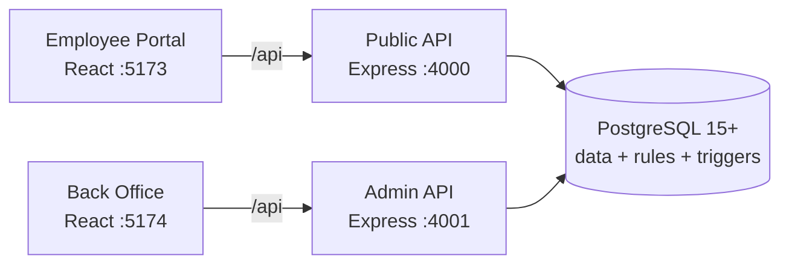

# Open Teams


**Open-source office HQ — people, departments, projects, tasks, HR requests, and team chat in one secure portal.**

Open Teams gives every employee a single place to do their work, while giving administrators a locked-down back office for identity, access, and security. One clear authorization model governs everything: **work only ever flows downhill.**

> Built with boring, dependable technology — **PostgreSQL, Node.js + Express, React + Vite** — with business rules enforced in the database, not just the UI. Run it on a laptop, a $10 VPS, or scale it on AWS. No cloud lock-in.

---

## Table of Contents

- [Why Open Teams](#why-open-teams)
- [Key Features](#key-features)
- [How Authorization Works](#how-authorization-works)
- [Tech Stack](#tech-stack)
- [Architecture](#architecture)
- [Quickstart](#quickstart)
- [Demo Organization](#demo-organization)
- [Using the Application](#using-the-application)
- [API Overview](#api-overview)
- [Project Structure](#project-structure)
- [Deployment](#deployment)
- [Security](#security)
- [Testing & Contributing](#testing--contributing)
- [License](#license)

---

## Why Open Teams

Most teams juggle five tools: an HR system, a project tracker, a task list, a directory, and chat. Context gets lost, permissions drift, and onboarding is painful.

Open Teams consolidates the daily workflow into two focused surfaces:

1. **Employee Portal (`Office HQ`)** — what everyone uses every day: my work, projects, long-lived team workspaces, company chat, and directory.
2. **Back Office (`Admin`)** — a separate, private surface for managing people, logins, email domains, sessions, and audit logs.

Both share one PostgreSQL database where delegation, HR, and department rules are enforced by triggers — so permissions hold no matter which client calls the API.

---

## Key Features

### People & Organization
- Company directory with rank-based visibility and individual profiles
- Departments (Engineering, Sales, Finance, Marketing, HR, IT) with chief-only governance
- Email-domain allow-list enforced at the database level

### Projects & Tasks
- Projects with charter, lifecycle, members, and roles (`owner` / `lead` / `member`)
- Tasks and subtasks with assignment, deadlines, comments, and full activity history
- Weekly status updates and project-level chat
- Workload-aware staffing: see active projects, open tasks, and allocation before adding someone, with `HEAVY LOAD` warnings

### Team Workspaces
- Long-lived team homes for departments and persistent groups
- Staffing requests fulfilled through a structured approval flow
- Role promotions with hierarchy checks

### HR Requests
- Anyone can file a ticket; tickets can only be assigned to HR staff
- Clean separation between requesters and resolvers

### Company Chat
- Group channels (public, department, private) with join/leave and membership control
- 1:1 direct messages, read receipts, and project-scoped chat threads

### Administration
- Employee provisioning, activation/deactivation, and one-time temporary passwords with forced change on first login
- Session management with sliding inactivity expiry
- Admin IP allow-listing, auth policy controls, and a full auth audit log
- Public and admin bundles built and verified separately — admin code never leaks into the employee bundle

---

## How Authorization Works

Every permission derives from a single, auditable principle:

> **Work flows downhill. You can delegate to your own rank or below — never above, never to yourself.**

| Example | Allowed | Reason |
|---|---|---|
| Manager (4) assigns task to Junior (1) | ✅ Yes | Downhill delegation |
| Junior (1) assigns task to Manager (4) | ❌ No | Uphill — rejected |
| Senior (3) adds Associate (2) to project | ✅ Yes | Same rank or below |
| Associate (2) removes Senior (3) | ❌ No | Uphill — rejected |
| C-Suite (5+) renames department | ✅ Yes | Chiefs govern the org |
| Manager (4) renames department | ❌ No | Chiefs only |

Key guarantees:

- **Enforced in PostgreSQL triggers**, not just API checks — direct SQL or API calls cannot bypass it.
- **Single project owner** — promoting a new owner demotes the previous one atomically.
- **Only project heads and chiefs** can grant head (`owner`/`lead`) roles.
- **HR tickets** route only to HR staff.
- The UI explains eligibility upfront (e.g. “Higher rank — ask a head or chief”), so errors are rare.

---

## Tech Stack

| Layer | Technology | Notes |
|---|---|---|
| Database | PostgreSQL 15+, 13 ordered migrations | Data + integrity rules + triggers + seed |
| API | Node.js 20+ / Express 4, raw parameterized SQL | No ORM; split `public` / `admin` personalities |
| Auth | scrypt passwords, short-lived JWE access tokens, rotating refresh cookies | Memory-only tokens, forced password reset, inactivity expiry |
| Frontend | React 18 + Vite, hand-rolled CSS | Zero UI framework; separate public/admin builds |
| DevOps | Docker Compose, Render Blueprint, GitHub Actions CI | One-command local or container setup |

---

## Architecture



- `ADMIN_MODE=public` exposes only employee routes; `ADMIN_MODE=admin` exposes only admin routes (other routes return 404).
- Production Docker Compose runs Postgres + both APIs + both portals together.
- CI verifies migrations apply in order, tests pass, and bundles contain no cross-leaks.

---

## Quickstart

**Prerequisites:** Node.js 20+, PostgreSQL 15+ (local mode) or Docker (container mode).

### Option A — Local development (recommended)

```bash
git clone https://github.com/Manikanta070610/open-teams.git
cd open-teams
./setup.sh            # interactive: configures backend/.env, installs, migrates, seeds, builds
```

Then run:

```bash
npm run dev --prefix backend     # API on :4000
npm run dev --prefix frontend    # Employee portal on :5173
```

Back-office dev server (optional):

```bash
VITE_BACKEND_TARGET=http://localhost:4001 npm run dev:admin --prefix frontend  # :5174
```

Open http://localhost:5173.

### Option B — Full stack with Docker

```bash
./setup.sh --docker
docker compose up -d db && docker compose run --rm migrate
docker compose up -d --build
```

- Employee portal: http://localhost:8080
- Back office: http://localhost:8081 (keep private)
- Public API: :4000 · Admin API: :4001

Other setup flags:

```bash
./setup.sh --help               # all options
./setup.sh --non-interactive    # servers / CI, reads env vars, no prompts
```

### Manual setup

```bash
createdb office_mgmt_final
for f in db/*.sql; do psql -d office_mgmt_final -v ON_ERROR_STOP=1 -q -f "$f"; done
cp backend/.env.example backend/.env   # set DATABASE_URL, AUTH_SECRET, SETUP_TOKEN
npm install --prefix backend && npm install --prefix frontend
npm test --prefix backend
npm run dev --prefix backend
npm run dev --prefix frontend
```

---

## Demo Organization

`./setup.sh` seeds a fictional 7-person company so you can evaluate every permission level immediately:

| Name | Email | Rank | Reports To |
|---|---|---|---|
| Ava Owner, CEO | `ceo@example.com` | 6 — Owner | — |
| Ben CTO | `cto@example.com` | 5 — C-Suite | Ava |
| Cara Manager | `manager@example.com` | 4 — Manager | Ben |
| Dev Senior | `l3@example.com` | 3 — Senior | Cara |
| Eli Associate | `l2@example.com` | 2 — Associate | Dev |
| Fay Junior | `l1@example.com` | 1 — Junior | Eli |
| Hana HR | `hr@example.com` | 3 — Senior (HR) | Ava |

```
Ava (6, CEO)
├── Ben (5, CTO)
│   └── Cara (4, Manager)
│       └── Dev (3, Senior)
│           └── Eli (2, Associate)
│               └── Fay (1, Junior)
└── Hana (3, HR)
```

Departments, a cross-department project, tasks, and chat history are pre-seeded.

**First login:** seed data creates people without passwords by design. Bootstrap the first admin, then provision the rest from the back office:

```bash
# 1. Create first admin ( CEO account works: ceo@example.com )
curl -X POST http://localhost:4000/api/admin/bootstrap \
  -H 'content-type: application/json' \
  -d '{"email":"ceo@example.com","password":"PickAStrongOne123","setupToken":"<SETUP_TOKEN from backend/.env>"}'

# 2. Log in at http://localhost:5174/admin.html → Employees → Add employee
#    or Access → Reset password. Share the one-time temp password;
#    users must change it on first login.
# 3. Delete SETUP_TOKEN from backend/.env — first admin exists, door closed.
```

> Try it: log in as Fay (rank 1) and attempt to assign a task to Cara — then log in as Cara and assign one to Fay. Only one succeeds. That is the downhill rule in action.

---

## Using the Application

**Employee Portal (`:5173`) — daily work:**

| Tab | Purpose |
|---|---|
| **My Work** | Everything assigned to you — your homepage |
| **Projects** | Charter, staffing, tasks + subtasks, comments, weekly updates, history, project chat |
| **Workspaces** | Persistent team homes with request-based staffing |
| **Chat** | Company groups and 1:1 DMs |
| **Directory** | People search, profiles, and self-service password change |

**Back Office (`:5174/admin.html`) — administration only:**

| Tab | Purpose |
|---|---|
| Overview | Headcount and activity at a glance |
| Employees | Search, edit, and provision logins |
| Domains | Allowed email domains (DB-enforced) |
| Access | Activate/deactivate users, reset passwords |
| Security | Session timeouts, admin IP allow-list, auth audit log |

Destructive UI actions always ask for confirmation. All routes except `/health` require authentication.

---

## API Overview

<details>
<summary><strong>Endpoint map (click to expand)</strong></summary>

| Area | Base | Highlights |
|---|---|---|
| Auth | `/api/auth` | login, refresh (rotation), verify, change-password, sessions, logout, policy |
| Admin | `/api/admin` | bootstrap, employees CRUD, email domains, overview, auth policy, allowed IPs, audit |
| Projects | `/api/projects` | charter + lifecycle, members, workload-aware candidates, tasks/subtasks, comments, updates, activity, project chat |
| Company Chat | `/api/chat` | groups + visibility + members + join/leave, group chat, DM threads, read receipts |
| Workspaces | `/api/workspaces` | teams, members, promotions, staffing requests, candidates |
| Dashboard | `/api/dashboard` | my work feed, gated person profiles |

</details>

---

## Project Structure

```
.
├── backend/            # Express API (public/admin modes), auth, projects, chat, workspaces
│   ├── src/            # Route handlers, DB layer, tokens, rate limits
│   └── test/           # Self-cleaning API tests (admin, auth, chat, projects, workspaces)
├── frontend/           # React + Vite — employee portal + back office (separate builds)
│   └── src/            # App, AdminApp, Projects, Chat, Workspaces, Dashboard
├── db/                 # 01–13 ordered SQL migrations + seed (schema, triggers, governance)
├── docker-compose.yml  # Postgres + both APIs + both portals
├── render.yaml         # Render Blueprint (DB + 4 services)
└── setup.sh            # One-command local / Docker / CI setup
```

**Conventions:** schema changes go in a new numbered `db/` migration (CI checks ordering); business rules belong in Postgres triggers first, API second, UI hints third.

---

## Deployment

| Target | Method |
|---|---|
| **Any VPS / EC2 / home server** | `./setup.sh --docker` — full stack via `docker-compose.yml` (portal `:8080`, back office `:8081`) |
| **Render** | Push to GitHub → Dashboard → New → Blueprint. `render.yaml` provisions Postgres + all four services; copy generated `AUTH_SECRET` to the admin backend |
| **AWS (scaled)** | RDS Postgres for data, backend image to ECR + two services (`ADMIN_MODE=public` / `admin`), static bundles on S3 + CloudFront. Keep the back office behind IP rules or a private subnet |

After deploy: set a strong `AUTH_SECRET`, bootstrap the first admin, then empty `SETUP_TOKEN`.

---

## Security

- scrypt password hashing; short-lived in-memory JWE access tokens + rotating refresh cookies
- Forced password change on first login; sliding inactivity expiry
- Rate-limited auth endpoints; admin IP allow-listing
- Separate public/admin API personalities — admin routes 404 from the employee surface
- Build-time verification that admin code never ships in the public bundle
- Secrets live in `backend/.env` or root `.env` (both gitignored) — never commit them

Found a vulnerability? Please open a private security advisory or contact the maintainers rather than filing a public issue.

---

## Testing & Contributing

```bash
npm test --prefix backend                          # API tests (self-cleaning — must stay green)
npm run build --prefix frontend                    # public bundle
npm run build:admin --prefix frontend              # admin bundle
```

Contributions are welcome — this is MIT-licensed open source:

1. Fork the repo and create a feature branch
2. Add a numbered migration under `db/` for schema changes
3. Put business rules in Postgres triggers first, then API, then UI
4. Ensure `npm test --prefix backend` passes and both frontend bundles build
5. Open a pull request with a clear description and screenshots for UI changes

Please keep PRs focused, follow the existing code style (raw SQL, small readable modules, hand-rolled CSS), and add tests for new API behavior.

---

## License

MIT — see [LICENSE](LICENSE).

Built and maintained by the Open Teams contributors. If it helps your team, please star the repo and share feedback via issues.
